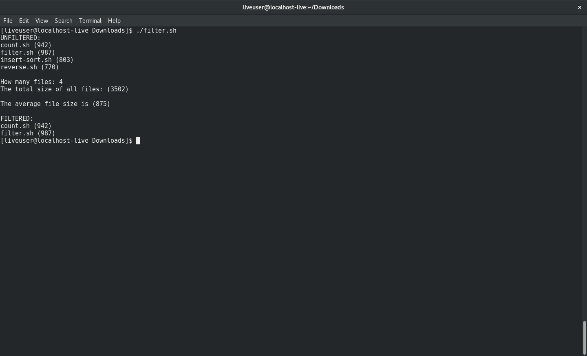

Displays certain files dependent upon their size by filtering out those less than the average.

This is done in the following way:
  1. main() function - Stores names and sizes of files into arrays NAME and SIZE.
  2. average() function - Calculates average size by dividing total size by number of files.
  3. filter() function - Displays files with sizes greater than average.

Limitations:
  1. Delimiter is 1 space & only works w/ sizes in hundreths place.

