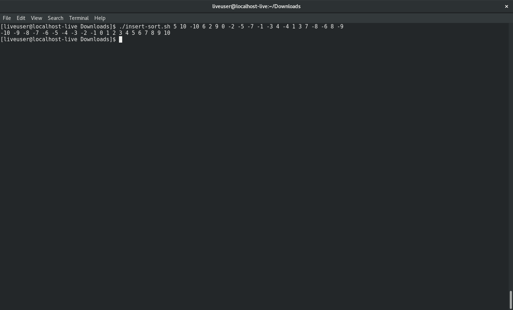

Takes numbers inserted in any order and sorts them in numerical order.

This is done in the following way:
  1. Takes user input and stores into SORT array.
  2. Compares current value with next and swaps if necessary.

  