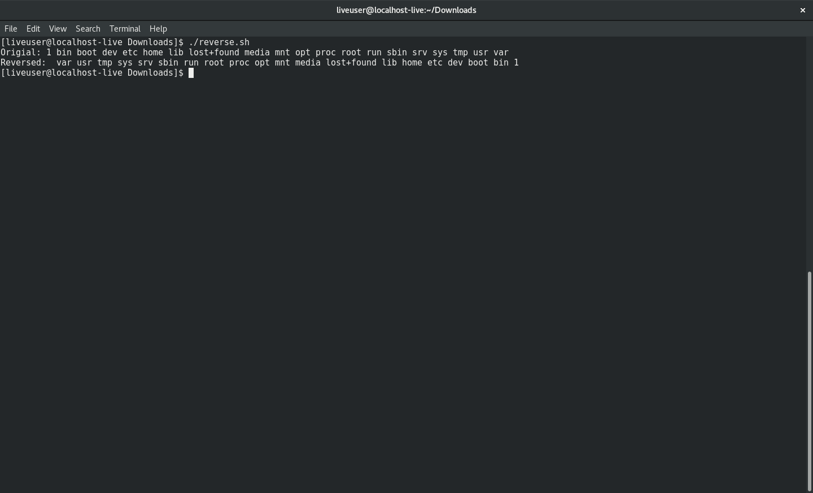

Stores the files stored in root directory and reverses the contents and displays them.

This is done in the following way:
  1. main() function - Stores files from root directory into CONTENTS array.
  2. reverse() function - Stores the contents from the CONTENTS array in decrementing order
     into the REVERSE array and echos the results.

