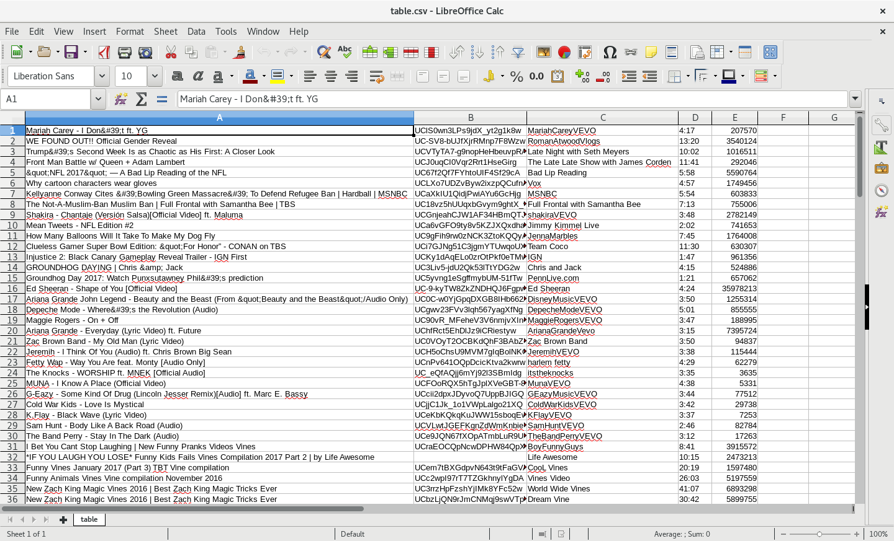
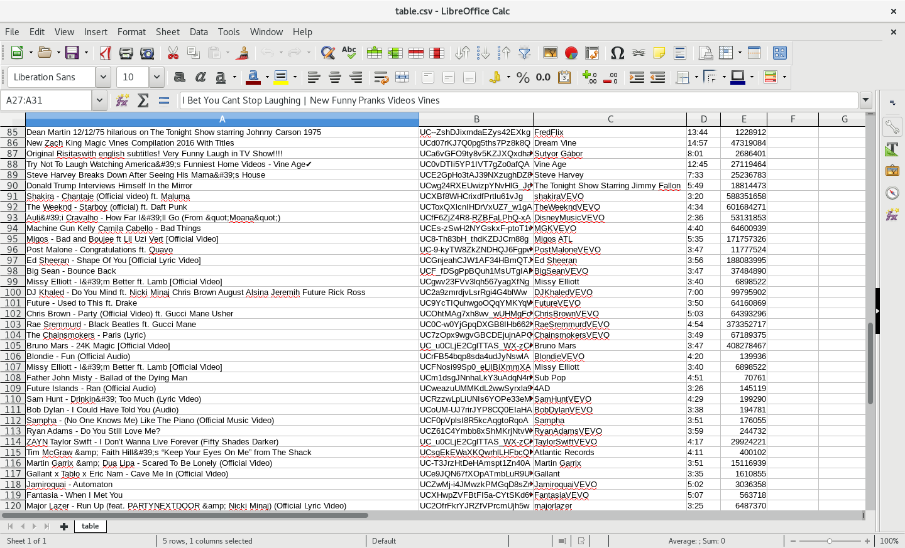

Web Scraping from YouTube's Trending page

The following files are created:
  1. titles.txt 	  --> List of video titles
  2. ids.txt 		    --> List of video ids
  3. user.txt 		  --> List of video users
  4. durations.txt	-->	List of video durations
  5. views.txt		  -->	List of video views
  6. table.csv		  --> List of everything above
  

